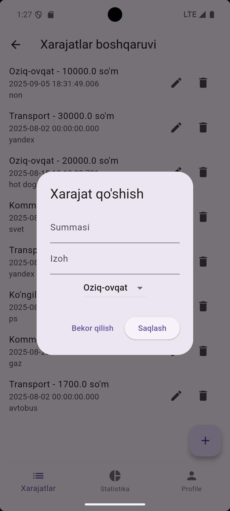

"=========================================="
 "         💰 Expense Tracker App           "
 "=========================================="

 ""
 "📌 Loyiha tavsifi"
 "Expense Tracker — bu Flutter’da yozilgan mobil ilova bo‘lib,"
 "kundalik xarajatlarni yozib borish, oylik byudjetni nazorat qilish"
 "Shuningdek, oxirgi 30 kunlik xarajatlar grafigini ko‘rish mumkin."

 "✨ Features"
 "- Xarajat qo‘shish (summa, kategoriya, sana, izoh bilan)"
 "- Xarajatlar ro‘yxatini ko‘rish va filtrlash"
 "- Oxirgi 30 kunlik xarajatlar grafigi"
 "- Oylik byudjet chegarasi oshganda ogohlantirish"
 "- Firebase orqali avtorizatsiya (login/signup)"
 "- Hive orqali offline rejimda ishlash"

### Sign In

### Sign Up

### Expenses

### Expenses category

### Add and edit category

### Statistics

### Profile

## 📲 APK yuklab olish
👉 [Download APK](https://drive.google.com/file/d/11hXm-PqEFD0cY8r7nN02arqy0Ic5uG-6/view?usp=drive_link)

